# Mini React 구현

### 1. 구현 목표

본 프로젝트는 React의 핵심 개념인 `Component`, `State`, `Hooks`, `Virtual DOM + Diff + Patch`를 학습하기 위해 최소 기능만 직접 구현한 mini React이다.  
실서비스용 프레임워크를 만드는 것이 아니라, 상태 변경 시 함수형 컴포넌트가 다시 실행되고, 새로운 Virtual DOM을 생성한 뒤 필요한 실제 DOM만 갱신하는 흐름을 설명 가능한 수준으로 구현하는 데 목적이 있다.

---

### 2. 전체 구조

루트 함수형 컴포넌트 `App`을 `FunctionComponent` 클래스로 감싸고, 이 인스턴스가 `hooks` 배열, `mount()`, `update()`를 관리하도록 구현하였다.  
초기 렌더링은 `mount()`가 담당하고, 이후 상태 변경이 발생하면 `update()`가 새로운 Virtual DOM을 만들고 `diff -> patch`를 수행한다.

### 처음 렌더링 `mount()`

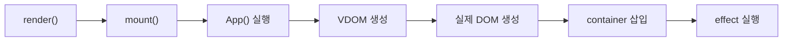

### 리렌더링 `update()`

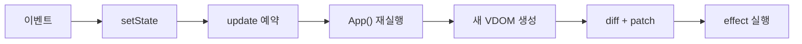

---

### 3. Component 구현

루트 `App`만 상태와 Hook을 가지고, 나머지 컴포넌트는 props만 받아 화면 조각을 렌더링한다.

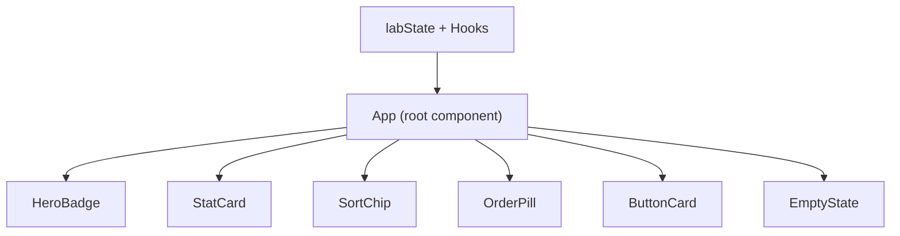

즉, 상태 변경은 `App`에서 시작하고, 자식 컴포넌트는 표현만 담당한다.

---

### 4. FunctionComponent 클래스

`FunctionComponent` 클래스는 루트 함수형 컴포넌트를 감싸는 실행 단위이며, 다음 기능을 포함한다.

- `hooks` 배열 : 상태값, effect 정보, memo 값을 저장한다.
- `mount()` : 최초 렌더링 시 루트 컴포넌트를 실행하고, Virtual DOM을 실제 DOM으로 변환해 컨테이너에 삽입한다.
- `update()` : 상태 변경 이후 루트 컴포넌트를 다시 실행하고, 이전 트리와 비교하여 필요한 부분만 실제 DOM에 반영한다.

테스트 페이지에서 이 구조는 화면 전체를 담당하는 `App` 하나를 기준으로 동작한다.  
예를 들어 버튼 클릭, 정렬 변경, 새 버튼 추가 등 모든 변화는 `App`의 `update()` 흐름을 통해 화면에 반영된다.

### 5. State 구현

state는 루트 `App`의 `labState` 하나로 모아서 관리하고, 각 화면 영역은 필요한 값만 props로 받는다.

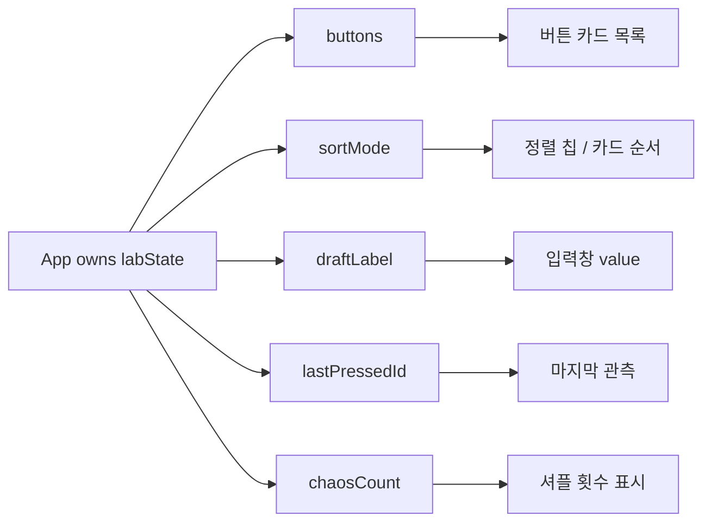

공유 상태를 루트에 모아 두었기 때문에 버튼 목록, 통계, 정렬, 입력창이 한 번의 update 흐름으로 함께 갱신된다.

---

### 6. Hooks 구현

#### 6-1. `useState`

`useState`는 `hooks[hookIndex]`에 값을 저장하고, `setState` 호출 시 update를 예약한다.

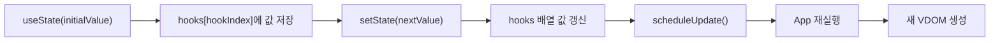

테스트 페이지에서는 버튼 클릭, 삭제, 정렬 변경, 입력창 값, 셔플, 초기화가 모두 `useState` 기반으로 동작한다.

#### 6-2. `useEffect`

`useEffect`는 deps가 바뀌면 effect를 예약하고, `patch`가 끝난 뒤 `flushEffects()`에서 실행한다.

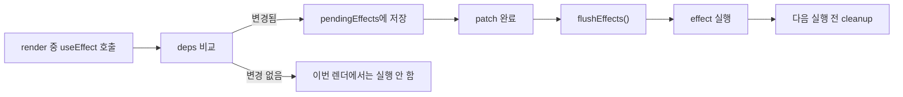

테스트 페이지에서는 `document.title` 변경, 콘솔 로그, `localStorage` 저장으로 effect가 화면 반영 이후에 실행됨을 보여 준다.

#### 6-3. `useMemo`

`useMemo`는 deps가 같으면 이전 계산 결과를 그대로 재사용하고, 바뀌면 다시 계산한다.

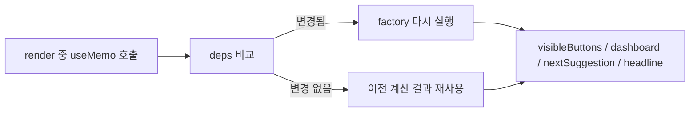

즉, 파생 데이터는 별도 state로 저장하지 않고 `useMemo` 계산 결과로 관리한다.

---

### 7. Hook 규칙 제한

Hook은 배열과 인덱스로 관리되기 때문에, 매 렌더마다 Hook 호출 순서가 같아야 한다.  
따라서 Hook은 루트 컴포넌트 최상위에서만 호출 가능하며, 조건문이나 반복문 내부에서 호출하면 안 된다.

본 구현에서는 다음 두 가지를 검사한다.

- Hook이 루트 렌더링 문맥에서 호출되었는지 검사
- 같은 `hookIndex` 위치에 다른 종류의 Hook이 들어오면 에러 발생

테스트 페이지에서는 실제 Hook 호출이 모두 `App`의 최상위에 배치되어 있다.  
반면 자식 컴포넌트인 `HeroBadge`, `StatCard`, `ButtonCard` 등은 Hook을 사용하지 않고 props만 받아 렌더링한다.

---

### 8. Diff + Patch 구현

이전 Virtual DOM과 새로운 Virtual DOM은 `diff()`에서 비교한다.  
비교 결과는 `CREATE`, `REMOVE`, `REPLACE`, `TEXT`, `UPDATE`, `NONE` 형태의 patch 정보로 정리된다.

`patch()`는 이 정보를 바탕으로 실제 DOM에 최소 변경만 적용한다.

- `CREATE` : 새 DOM 노드 생성
- `REMOVE` : 기존 DOM 노드 제거
- `REPLACE` : 노드 교체
- `TEXT` : 텍스트 노드 값 변경
- `UPDATE` : props 갱신 후 자식 patch 반영

테스트 페이지에서 각 기능은 다음 patch 상황을 보여 준다.

- 새 버튼 생성 : `CREATE`
- 버튼 삭제 : `REMOVE`
- 버튼 클릭 횟수 증가 : `TEXT` 또는 `UPDATE`
- 정렬 변경 / 셔플 : key 기반 children 비교 후 reorder
- 빈 상태 전환 : 버튼 목록과 `EmptyState` 사이의 구조 변화

즉, 이 테스트 페이지는 diff/patch가 실제로 어떤 종류의 화면 변경을 처리하는지 확인하기 위한 데모 역할도 한다.

---

### 9. Key 기반 children 비교

정렬이나 셔플이 발생해도 같은 `id`를 가진 child는 같은 항목으로 매칭하고, DOM 노드는 가능한 한 재사용한다.

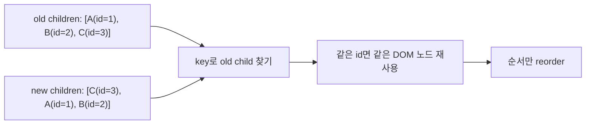

테스트 페이지에서는 `visibleButtons.map(...)`와 `OrderPill` 목록 모두 `key={button.id}`를 사용한다.

---

### 10. setState가 상태 변경 외에 하는 일

`setState`는 값만 바꾸는 함수가 아니라, 전체 렌더링 파이프라인을 다시 시작하는 진입점이다.

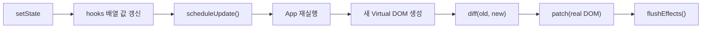

버튼 클릭, 정렬 변경, 입력값 변경, 삭제, 추가, 초기화는 모두 이 흐름으로 처리된다.

---

### 11. batching

같은 tick 안의 여러 `setState`는 하나의 `update()`로 묶이도록 구현하였다.

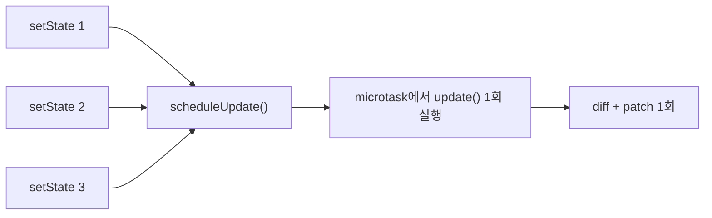

즉, 여러 상태 변경이 곧바로 여러 번의 DOM 수정으로 이어지지 않고, 하나의 update 흐름으로 수집된다.

---

### 12. 테스트 페이지에서 최소 구현 대상이 드러나는 위치

과제의 최소 구현 대상과 테스트 페이지의 대응 관계는 다음과 같다.

| 최소 구현 대상             | 테스트 페이지에서 확인 가능한 부분                                                  |
| -------------------------- | ----------------------------------------------------------------------------------- |
| 함수형 컴포넌트            | `App`, `HeroBadge`, `StatCard`, `SortChip`, `OrderPill`, `ButtonCard`, `EmptyState` |
| `FunctionComponent` 클래스 | 페이지 전체 최초 렌더링과 이후 모든 상태 변경 시 재렌더링                           |
| `hooks` 배열               | `App`의 `useState`, `useEffect`, `useMemo` 호출 순서 관리                           |
| `mount()`                  | 페이지 첫 진입 시 전체 화면이 처음 그려지는 과정                                    |
| `update()`                 | 버튼 클릭, 정렬 변경, 입력, 추가, 삭제, 초기화 시 화면 갱신                         |
| `useState`                 | 버튼 클릭 횟수, 입력창 값, 정렬 상태, 버튼 목록 변경                                |
| `useEffect`                | `document.title` 변경, 콘솔 로그, localStorage 저장                                 |
| `useMemo`                  | 정렬된 버튼 목록, 통계 정보, 추천 버튼, 상단 문구 계산                              |
| Virtual DOM 생성           | Hero, 통계 카드, 패널, 버튼 카드 목록 전체 UI                                       |
| Diff                       | 이전 화면과 새 화면 비교                                                            |
| Patch                      | 바뀐 카드, 텍스트, 정렬 순서, 빈 상태만 실제 DOM 반영                               |
| key 기반 children 비교     | 버튼 카드 목록, 렌더 순서 표시 목록                                                 |

이처럼 테스트 페이지는 단순한 예시 화면이 아니라, 과제의 필수 구현 요소를 실제 동작으로 확인하기 위한 검증용 페이지로 설계하였다.

---

### 13. 테스트 케이스

#### 13-1. 단위 테스트

- `createElement`
  - 중첩 children 평탄화
  - 문자열/숫자 children의 `TEXT_ELEMENT` 변환
  - `key` 유지 여부
- `resolveVNode`
  - stateless child component 실행
  - function component에서 host VDOM으로 해석되는지 확인
  - child의 `key`가 host node까지 전달되는지 확인
- `diff + patch`
  - props 변경 반영
  - text 노드 변경 반영
  - keyed children reorder 시 기존 DOM 노드 재사용 여부 확인

#### 13-2. 모듈 테스트

- `useState`
  - 초기값 저장
  - 같은 Hook 슬롯 재사용
  - 같은 값으로 `setState` 시 rerender 생략
- `useMemo`
  - dependency 변경 시에만 재계산
  - 관련 없는 state 변경에서는 이전 계산 결과 재사용
- `useEffect`
  - mount 후 effect 실행
  - dependency 변경 시 cleanup 후 재실행
  - unmount 시 cleanup 실행
- `FunctionComponent`
  - `scheduleUpdate()`를 통한 update 예약
  - 같은 tick 안의 중복 update 예약 방지
- Hook 규칙 제한
  - child component에서 Hook 호출 시 에러 발생

#### 13-3. 기능 테스트

현재 기능 테스트는 자동화 스크립트가 아니라, 브라우저에서 직접 확인하는 수동 체크리스트로 운영한다.

- 버튼 클릭 시
  - 클릭 수 카드
  - 가장 뜨거운 버튼
  - 마지막 관측
  - `document.title`
    가 함께 갱신되는지 확인
- 정렬 모드 변경 시
  - 카드 순서가 바뀌는지 확인
  - stable key 기준으로 같은 버튼 카드가 유지되는지 확인
- 새 버튼 생성 / 삭제 시
  - `CREATE`, `REMOVE` 상황이 실제 화면에서 드러나는지 확인
- 새로고침 시
  - `localStorage` 기반 복원으로 이전 상태가 유지되는지 확인

#### 13-4. 엣지 케이스 아이디어

- `localStorage` 값이 깨져 있을 때 기본 상태로 fallback 되는지
- 모든 버튼을 삭제했을 때 `EmptyState`가 정상적으로 보이는지
- 같은 정렬 모드를 연속 클릭했을 때 불필요한 변화가 없는지
- 추천 버튼이 모두 소진됐을 때 `추천 버튼 소진` 상태가 유지되는지
- Hook을 조건문/child component에서 잘못 사용할 때 방어 로직이 동작하는지
- key가 없는 리스트와 key가 있는 리스트의 reorder 차이를 비교 설명할 수 있는지

#### 13-5. 실제 테스트 진행 방법

2026년 4월 2일 기준, 자동 검증은 아래 명령으로 직접 실행하였다.

```bash
npm test
```

실행 결과는 다음과 같다.

- `createElement` 단위 테스트 통과
- `resolveVNode` 단위 테스트 통과
- `diff + patch` 단위 테스트 통과
- `useState + useMemo + useEffect + batching` 통합 단위 테스트 통과
- child component의 Hook 오용 방어 테스트 통과
- 즉, 현재 저장소에서는 core 모듈 단위 검증과 Hook/runtime 검증까지는 자동화되어 있고, 기능 테스트와 엣지 케이스는 발표 전 브라우저에서 수동 체크리스트로 확인하는 방식이다.

---

### 14. 협업

#### 14-1. 작업 시간 분배

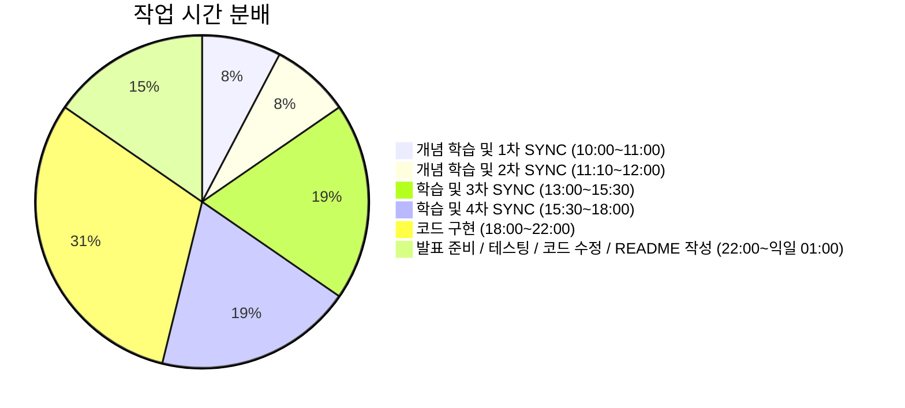

#### 14-2. 역할 분담

| 이름   | 역할                                                |
| ------ | --------------------------------------------------- |
| 고윤서 | 코드 구현, 코드 수정                                |
| 김규민 | 테스트 페이지 구현, 발표                            |
| 염태선 | 코드 수정, 테스트 페이지 고도화, 테스트 케이스 작성 |
