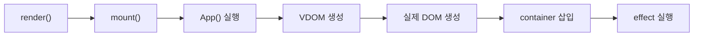
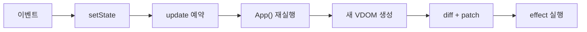

## 기술 구현

### 1. 구현 목표
본 프로젝트는 React의 핵심 개념인 `Component`, `State`, `Hooks`, `Virtual DOM + Diff + Patch`를 학습하기 위해 최소 기능만 직접 구현한 mini React이다.  
실서비스용 프레임워크를 만드는 것이 아니라, 상태 변경 시 함수형 컴포넌트가 다시 실행되고, 새로운 Virtual DOM을 생성한 뒤 필요한 실제 DOM만 갱신하는 흐름을 설명 가능한 수준으로 구현하는 데 목적이 있다.

---

### 2. 전체 구조
루트 함수형 컴포넌트 `App`을 `FunctionComponent` 클래스로 감싸고, 이 인스턴스가 `hooks` 배열, `mount()`, `update()`를 관리하도록 구현하였다.  
초기 렌더링은 `mount()`가 담당하고, 이후 상태 변경이 발생하면 `update()`가 새로운 Virtual DOM을 만들고 `diff -> patch`를 수행한다.

### 처음 렌더링 `mount()`

### 리렌더링 `update()`

---

### 3. Component 구현
모든 컴포넌트는 함수형 컴포넌트로 구현하였다.  
루트 컴포넌트는 `App` 하나이며, 나머지 컴포넌트는 모두 props만 받아 화면을 렌더링하는 stateless pure function으로 구성하였다.

테스트 페이지에서의 구성은 다음과 같다.

- 루트 컴포넌트
  - `App`
- 자식 컴포넌트
  - `HeroBadge`
  - `StatCard`
  - `SortChip`
  - `OrderPill`
  - `ButtonCard`
  - `EmptyState`

즉, 상태와 Hook은 `App`에만 두고, 자식 컴포넌트는 표현 역할만 담당하도록 분리하였다. 이는 과제의 `Lifting State Up` 제약을 반영한 구조이다.

---

### 4. FunctionComponent 클래스
`FunctionComponent` 클래스는 루트 함수형 컴포넌트를 감싸는 실행 단위이며, 다음 기능을 포함한다.

- `hooks` 배열
  - 상태값, effect 정보, memo 값을 저장한다.
- `mount()`
  - 최초 렌더링 시 루트 컴포넌트를 실행하고, Virtual DOM을 실제 DOM으로 변환해 컨테이너에 삽입한다.
- `update()`
  - 상태 변경 이후 루트 컴포넌트를 다시 실행하고, 이전 트리와 비교하여 필요한 부분만 실제 DOM에 반영한다.

테스트 페이지에서 이 구조는 화면 전체를 담당하는 `App` 하나를 기준으로 동작한다.  
예를 들어 버튼 클릭, 정렬 변경, 새 버튼 추가 등 모든 변화는 `App`의 `update()` 흐름을 통해 화면에 반영된다.

---

### 5. State 구현
state는 루트 컴포넌트 `App`에서만 관리한다.  
현재 테스트 페이지에서는 `labState` 하나에 아래 상태를 모아 저장한다.

- `buttons`
- `sortMode`
- `draftLabel`
- `lastPressedId`
- `chaosCount`

이 상태는 자식 컴포넌트에 props로 내려가며, 자식은 상태를 직접 가지지 않는다.

테스트 페이지에서 state가 드러나는 부분은 다음과 같다.

- `buttons`
  - 버튼 카드 목록 자체
- `sortMode`
  - 정렬 칩 선택 상태와 버튼 카드 정렬 결과
- `draftLabel`
  - 새 버튼 입력창 값
- `lastPressedId`
  - 우측 상단 마지막 관측 영역
- `chaosCount`
  - 셔플 횟수 표시

이 구조를 통해 상태가 루트에서만 관리되고, UI 전체가 하나의 상태 저장소에 의해 일관되게 갱신되는 흐름을 보여 준다.

---

### 6. Hooks 구현

#### 6-1. `useState`
`useState`는 현재 `hookIndex` 위치의 `hooks` 배열에 상태 값을 저장한다.  
초기 렌더에서는 초기값을 저장하고, 이후에는 같은 인덱스의 값을 재사용한다.

`setState`가 호출되면 다음 순서로 동작한다.

1. `hooks` 배열의 상태 값 갱신
2. `scheduleUpdate()` 호출
3. `update()` 예약
4. 루트 컴포넌트 재실행
5. 새 Virtual DOM 생성
6. diff + patch 수행

테스트 페이지에서 `useState`는 다음 부분에 사용된다.

- 버튼 클릭 횟수 증가
  - 각 `ButtonCard`의 클릭 버튼
- 버튼 삭제
  - 각 `ButtonCard`의 `연구 종료` 버튼
- 정렬 모드 변경
  - `실험 순`, `인기 순`, `이름 순` 칩
- 새 버튼 생성
  - 입력창 + 생성 버튼
- 셔플 / 초기화
  - `혼돈 셔플 실행`, `기본 연구실 초기화`

#### 6-2. `useEffect`
`useEffect`는 dependency 배열을 비교한 뒤, 값이 바뀌었을 때 실행할 effect를 `pendingEffects`에 저장한다.  
effect는 렌더 도중 바로 실행되지 않고, `patch`가 끝난 뒤 `flushEffects()` 단계에서 실행된다.

테스트 페이지에서 `useEffect`는 두 곳에 사용된다.

- `document.title` 변경 및 콘솔 로그 출력
  - 클릭 수가 바뀐 뒤 effect가 실행됨
  - cleanup 시점도 콘솔로 확인 가능
- localStorage 저장
  - 버튼 목록, 정렬 상태, 마지막 클릭 정보 등을 브라우저 저장소에 유지

즉, 테스트 페이지는 `useEffect`가 “화면 렌더링”이 아니라 “화면 반영 이후의 부수효과”를 처리한다는 점을 보여 준다.

#### 6-3. `useMemo`
`useMemo`는 dependency가 바뀌지 않으면 이전 계산 결과를 재사용한다.  
이를 통해 원본 state에서 파생되는 값을 별도의 state로 중복 저장하지 않고 관리할 수 있다.

테스트 페이지에서 `useMemo`는 다음 부분에 사용된다.

- `visibleButtons`
  - 정렬 모드에 따라 버튼 목록을 계산
- `dashboard`
  - 총 클릭 수, 최다 클릭 버튼, 최저 클릭 버튼, 마지막 클릭 버튼 계산
- `nextSuggestion`
  - 아직 추가되지 않은 추천 버튼 계산
- `headline`
  - 상단 설명 문구 계산

이로써 “파생 데이터는 state가 아니라 계산 결과로 관리한다”는 점을 보여 준다.

---

### 7. Hook 규칙 제한
Hook은 배열과 인덱스로 관리되기 때문에, 매 렌더마다 Hook 호출 순서가 같아야 한다.  
따라서 Hook은 루트 컴포넌트 최상위에서만 호출 가능하며, 조건문이나 반복문 내부에서 호출하면 안 된다.

본 구현에서는 다음 두 가지를 검사한다.

- Hook이 루트 렌더링 문맥에서 호출되었는지 검사
- 같은 `hookIndex` 위치에 다른 종류의 Hook이 들어오면 에러 발생

테스트 페이지에서는 실제 Hook 호출이 모두 `App`의 최상위에 배치되어 있다.  
반면 자식 컴포넌트인 `HeroBadge`, `StatCard`, `ButtonCard` 등은 Hook을 사용하지 않고 props만 받아 렌더링한다.

---

### 8. Diff + Patch 구현
이전 Virtual DOM과 새로운 Virtual DOM은 `diff()`에서 비교한다.  
비교 결과는 `CREATE`, `REMOVE`, `REPLACE`, `TEXT`, `UPDATE`, `NONE` 형태의 patch 정보로 정리된다.

`patch()`는 이 정보를 바탕으로 실제 DOM에 최소 변경만 적용한다.

- `CREATE`
  - 새 DOM 노드 생성
- `REMOVE`
  - 기존 DOM 노드 제거
- `REPLACE`
  - 노드 교체
- `TEXT`
  - 텍스트 노드 값 변경
- `UPDATE`
  - props 갱신 후 자식 patch 반영

테스트 페이지에서 각 기능은 다음 patch 상황을 보여 준다.

- 새 버튼 생성
  - `CREATE`
- 버튼 삭제
  - `REMOVE`
- 버튼 클릭 횟수 증가
  - `TEXT` 또는 `UPDATE`
- 정렬 변경 / 셔플
  - key 기반 children 비교 후 reorder
- 빈 상태 전환
  - 버튼 목록과 `EmptyState` 사이의 구조 변화

즉, 이 테스트 페이지는 diff/patch가 실제로 어떤 종류의 화면 변경을 처리하는지 확인하기 위한 데모 역할도 한다.

---

### 9. Key 기반 children 비교
children 비교는 key를 우선 기준으로 구현하였다.  
리스트 항목에 stable key가 있으면, 순서가 바뀌더라도 같은 항목으로 인식하여 기존 DOM 노드를 가능한 한 재사용할 수 있다.

테스트 페이지에서 key 기반 diff가 가장 잘 드러나는 부분은 다음 두 곳이다.

- 버튼 카드 목록
  - `visibleButtons.map(...)`에서 `key={button.id}` 사용
- 현재 렌더 순서 표시 영역
  - `OrderPill` 목록에서 `key={button.id}` 사용

정렬 모드 변경이나 셔플이 발생해도 같은 버튼은 같은 `id`를 유지하므로, key 기반 children 비교가 실제로 동작하는 것을 설명할 수 있다.

---

### 10. setState가 상태 변경 외에 하는 일
본 프로젝트에서 `setState`는 단순히 값을 바꾸는 함수가 아니라, 전체 업데이트 흐름의 시작점이다.

동작 순서는 다음과 같다.

1. 상태 저장소(`hooks` 배열) 갱신
2. `scheduleUpdate()` 호출
3. 루트 컴포넌트 `App` 재실행
4. 새로운 Virtual DOM 생성
5. 이전 Virtual DOM과 diff 수행
6. 바뀐 부분만 실제 DOM에 patch
7. patch 이후 `useEffect` 실행

테스트 페이지에서는 버튼 클릭, 정렬 변경, 입력값 변경, 삭제, 추가, 초기화 모든 동작이 이 흐름을 따른다.

---

### 11. batching
같은 tick 안에서 여러 번 `setState`가 호출되더라도, 중복 `update()` 예약을 막아 한 번의 재렌더링으로 묶는 간단한 batching을 적용하였다.  
이를 통해 상태 변경이 즉시 DOM을 직접 수정하는 것이 아니라, 하나의 update 흐름으로 수집된 뒤 반영된다는 점을 보여 준다.

현재 테스트 페이지에서는 주로 개별 이벤트 중심으로 동작하지만, 구현 자체는 여러 상태 변경을 한 번의 update로 묶을 수 있도록 설계되어 있다.  
즉, batching은 선택 과제이지만, 본 구현에서는 간단한 형태로 반영하였다.

---

### 12. 테스트 페이지에서 최소 구현 대상이 드러나는 위치
과제의 최소 구현 대상과 테스트 페이지의 대응 관계는 다음과 같다.

| 최소 구현 대상 | 테스트 페이지에서 확인 가능한 부분 |
|---|---|
| 함수형 컴포넌트 | `App`, `HeroBadge`, `StatCard`, `SortChip`, `OrderPill`, `ButtonCard`, `EmptyState` |
| `FunctionComponent` 클래스 | 페이지 전체 최초 렌더링과 이후 모든 상태 변경 시 재렌더링 |
| `hooks` 배열 | `App`의 `useState`, `useEffect`, `useMemo` 호출 순서 관리 |
| `mount()` | 페이지 첫 진입 시 전체 화면이 처음 그려지는 과정 |
| `update()` | 버튼 클릭, 정렬 변경, 입력, 추가, 삭제, 초기화 시 화면 갱신 |
| `useState` | 버튼 클릭 횟수, 입력창 값, 정렬 상태, 버튼 목록 변경 |
| `useEffect` | `document.title` 변경, 콘솔 로그, localStorage 저장 |
| `useMemo` | 정렬된 버튼 목록, 통계 정보, 추천 버튼, 상단 문구 계산 |
| Virtual DOM 생성 | Hero, 통계 카드, 패널, 버튼 카드 목록 전체 UI |
| Diff | 이전 화면과 새 화면 비교 |
| Patch | 바뀐 카드, 텍스트, 정렬 순서, 빈 상태만 실제 DOM 반영 |
| key 기반 children 비교 | 버튼 카드 목록, 렌더 순서 표시 목록 |

이처럼 테스트 페이지는 단순한 예시 화면이 아니라, 과제의 필수 구현 요소를 실제 동작으로 확인하기 위한 검증용 페이지로 설계하였다.

---

### 13. 중점 포인트 반영

#### UI를 어떻게 Component로 나눌 것인가
UI는 상태를 직접 가지는 루트 컴포넌트와, props만 받아 화면 일부를 표현하는 자식 컴포넌트로 나누었다.  
이 기준을 통해 상태 관리와 표현 로직을 분리하고, 자식 컴포넌트를 stateless pure function으로 유지하였다.

#### State를 어디에 두는 것이 좋은가
상태는 루트 `App`에 두는 것이 가장 적절하다고 판단하였다.  
버튼 목록, 통계 정보, 정렬 상태, 입력값, 저장 로직이 모두 연결되어 있으므로, 상태를 한 곳에 모아 두어야 데이터 일관성과 설명 가능성을 유지할 수 있다.

#### setState는 상태 변경 외에 무엇을 해야 하는가
`setState`는 단순한 값 변경으로 끝나지 않고, update 예약, 새 Virtual DOM 생성, diff, patch, effect 실행까지 이어지는 전체 렌더링 파이프라인의 시작점 역할을 한다.  
즉, “상태 변경 -> 화면 갱신”이 자동으로 연결되도록 설계하였다.

#### 여러 상태 변경을 한 번에 처리하는 방법
실제 React처럼 복잡한 scheduler는 구현하지 않았지만, 같은 tick 안의 여러 상태 변경을 하나의 `update()`로 묶는 간단한 batching을 적용하였다.  
이를 통해 여러 상태 변경이 곧바로 여러 번 DOM 수정으로 이어지지 않도록 하였다.

#### 실제 React와의 차이점
본 구현은 학습용 mini React이므로 실제 React와 차이가 있다.

- Fiber 없음
- scheduler 없음
- concurrent rendering 없음
- Hook 저장 방식은 단순한 배열 + 인덱스 구조
- diff/patch 알고리즘도 학습용으로 단순화
- state는 루트 컴포넌트에서만 관리

즉, 본 프로젝트는 React의 핵심 원리를 이해하기 위한 축소 모델이며, 실서비스용 React 전체를 재현하는 것이 목적은 아니다.
